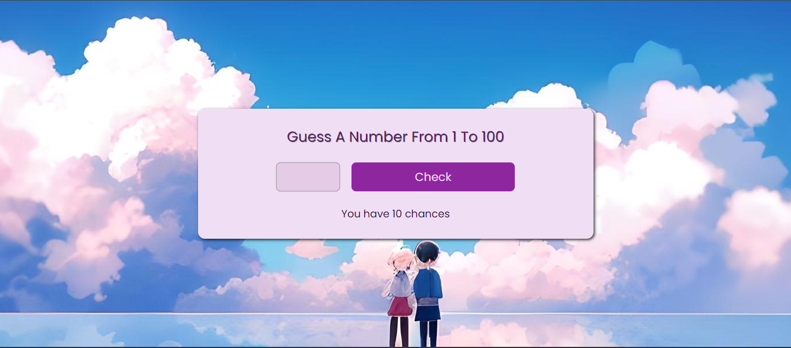

# 🎮 Number Guessing Game in JavaScript

This is a simple **Number Guessing Game** built using **HTML**, **CSS**, and **JavaScript**. In this game, users have 10 chances to guess a random number between 1 and 100.

## 🔗 Demo

You can check out the live demo of the project here: [Number Guessing Game](https://ajay-dhangar.github.io/number-guess-game/)

---

## 🛠️ Tech Stack

- **HTML5** - Structure and content of the page.
- **CSS3** - Styling with a modern, responsive design.
- **JavaScript** - Game logic and interactivity.

## 💡 Features

- User has 10 chances to guess the random number.
- The app indicates whether the guess is too high or too low.
- After 10 wrong attempts, the user loses the game and can restart.
- Responsive design, compatible with mobile devices.

---

## 📷 Screenshot



---

## 🚀 Getting Started

To run this project locally:

1. Clone the repository:

   ```bash
   git clone https://github.com/yourusername/number-guessing-game.git
   ```

2. Navigate to the project folder:

   ```bash
   cd number-guessing-game
   ```

3. Open `index.html` in your browser to play the game.

---

## 📝 How to Play

1. Enter a number between 1 and 100.
2. Click **Check** to see if your guess is correct.
3. You have 10 chances to guess the correct number.
4. If your guess is too high or too low, the game will give you hints.
5. After 10 chances or if you guess the correct number, you can click **Replay** to start again.

---

## 🔧 Code Structure

- `index.html` - The structure and layout of the game.
- `style.css` - The styles for the game UI, with Google Fonts and media queries for responsiveness.
- `script.js` - The game logic, including the number guessing, chances, and game status updates.

---

## 🧑‍💻 Author

**Ajay Dhangar**  
I'm a passionate web developer focused on creating user-friendly and interactive web applications.  
Check out more of my projects below and feel free to connect!

- [Portfolio](https://ajay-dhangar.github.io/)
- [Website - CodeHarborHub](https://codeharborhub.github.io/)

---

## 📄 License

This project is licensed under the MIT License - see the [LICENSE](LICENSE) file for details.

---

## 🗣️ Connect with Me

Let's stay in touch!  
Follow me on social media for more web development content, tips, and project updates.

- Twitter: [@CodesWithAjay](https://x.com/CodesWithAjay)
- LinkedIn: [Ajay Dhangar](https://www.linkedin.com/in/ajay-dhangar)
- GitHub: [Ajay-Dhangar](https://github.com/Ajay-Dhangar)